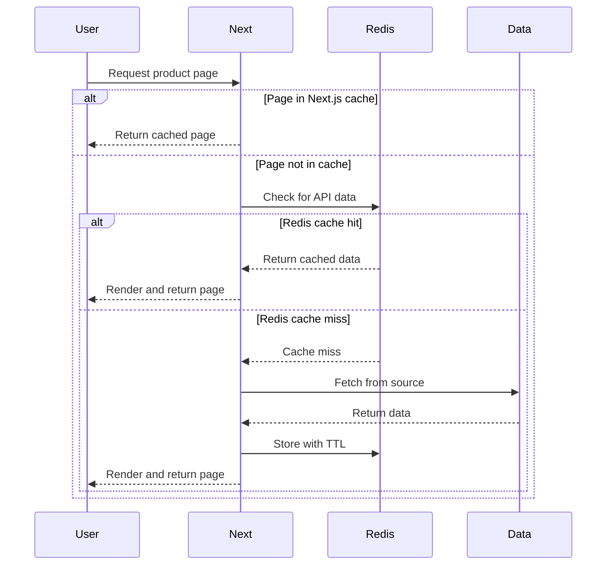
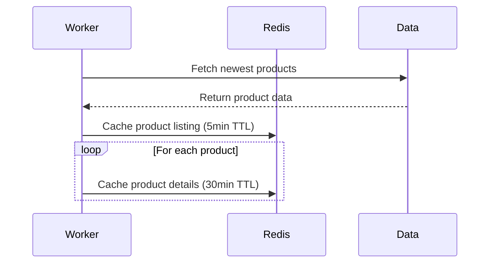
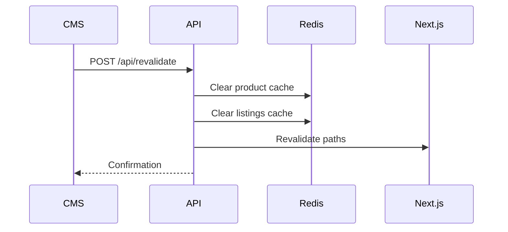

# SnackShop - E-commerce Demo

This project demonstrates an e-commerce application for an online store with Next.js and Redis caching. It's designed to **simulate a large-scale marketplace (20K+ products, 5M+ users)** where page load speed and server performance are critical.

👈 [برای مطالعه نسخه فارسی این راهنما، اینجا کلیک کنید.](./src/docs/README-FA.md)

---


<div style="display: flex; justify-content: center;">
  
</div>

## Core Architecture

- **Framework**: Next.js 15 App Router
- **Caching**: Redis-based `caching strategy` for product data & API responses
- **Rendering**: `Hybrid rendering approach` optimized for each page type
- **i18n**: Supports English & Farsi using `next-intl`
- **State Management**: Cart data stored in `Redis` with client-side `Zustand`
- **Testing**: Unit and E2E tests with `Jest` and `Cypress`

## Deliberate Constraints

- **Minimal use of external libraries**: To reduce the complexity, as well as the bundle size.
- **No UI libraries**: Only css modules are used for styling.
- **No authentication**: No authentication is implemented, only a session id cookie is used to keep track of the cart.
- **No analytics**: No analytics are implemented. I deliberately decided to cache 8 of the newest products as a simulation of high-traffic products.
- **No database**: Only a json file is used to store the product data for simplicity.

## Rendering Patterns

Each page type employs a specific Next.js rendering strategy, further enhanced by Redis caching, to optimize for performance and data freshness in a simulated large-scale environment.

### Product Listing Pages (PLP - `/`)

- **Next.js Strategy**: Dynamic Rendering with **Incremental Static Regeneration (ISR)**.
  - The page utilizes React Server Components for server-side data fetching.
  - `export const revalidate = 60;` in `src/app/[locale]/page.tsx` configures Next.js to regenerate the page at most once every 60 seconds upon request.
- **Reasoning**: Balances data freshness with performance. Ensures users see relatively up-to-date product listings without hitting the origin API on every request, while ISR keeps the page updated periodically.
- **Redis Cache Strategy**:
  - Product list API responses fetched by `fetchProducts` are cached in Redis with a **5-minute TTL** (`PRODUCT_LIST_CACHE_TTL`).
  - This Redis cache acts as a faster layer before the Next.js ISR regeneration might trigger an API call.

```tsx
// src/app/[locale]/page.tsx - Configures Next.js ISR
export const revalidate = 60; // Regenerate page max once per 60s

// src/features/products/ProductList/index.tsx - Uses RSC for data fetching
export async function ProductList({ locale, searchParams }: ProductListProps) {
  // ...fetches data using fetchProducts which interacts with Redis cache...
}

// src/constants/index.ts - Defines Redis TTL for product list API data
export const PRODUCT_LIST_CACHE_TTL = 5 * 60; // 5 minutes
```

### Product Details Pages (PDP - `/products/[productId]`)

- **Next.js Strategy**: **Static Site Generation (SSG)** at build time for a subset of products (newest 8), combined with **Incremental Static Regeneration (ISR)** for all product pages.
  - `generateStaticParams` in `src/app/[locale]/products/[productId]/page.tsx` pre-renders the details pages for the 8 newest products during the build process.
  - `export const revalidate = 3600;` applies ISR to _all_ product detail pages (pre-rendered or not), allowing regeneration at most once per hour upon request.
  - `export const dynamicParams = true;` ensures that pages for products _not_ pre-rendered at build time are generated on the first request and then follow the ISR `revalidate` interval.
- **Reasoning**: Optimizes for high-traffic products by serving them statically from the edge/CDN after build. ISR ensures that even less popular product pages remain reasonably up-to-date without requiring a full rebuild.
- **Redis Cache Strategy**:
  - Individual product detail API responses fetched by `fetchProductById` are cached in Redis with a **30-minute TTL** (`PRODUCT_DETAIL_CACHE_TTL`).
  - This provides an intermediate cache layer, faster than waiting for the 1-hour ISR interval if the data is needed sooner.

```tsx
// src/app/[locale]/products/[productId]/page.tsx
export const revalidate = 3600; // Regenerate page max once per hour (ISR)
export const dynamicParams = true; // Allow generating pages not built initially

// Pre-renders pages for the 8 newest products at build time (SSG subset)
export async function generateStaticParams() {
  // ... fetches and returns { productId, locale } for newest 8 products ...
  const newestProductIds = allProducts.slice(0, 8).map((p) => p.id);
  // ...
}

// src/constants/index.ts - Defines Redis TTL for product detail API data
export const PRODUCT_DETAIL_CACHE_TTL = 30 * 60; // 30 minutes
```

### Cart & Checkout

- **Implementation**: Client-side with Zustand for state management
- **Reasoning**: Provides immediate user feedback while minimizing server load
- **Persistence**: Cart data synced to Redis for consistency

```tsx
// src/store/store.ts
import { create } from "zustand";
export const useCartStore = create<CartState>()((set, get) => ({
  // Cart operations that sync with the server
  fetchCart: async () => {
    // Fetch from /api/cart
  },
  addToCart: async (product, quantity = 1) => {
    // Optimistic updates and server sync
  },
  // ...
}));
```

## Performance Optimizations

### Multi-layered Caching Architecture

This project implements a multi-layered caching strategy to handle high traffic loads:

1. **Next.js ISR Layer**: Utilizing Incremental Static Regeneration to cache rendered pages
2. **Redis Cache Layer**: Caching API responses before they reach Next.js
3. **CDN/Edge Layer**: When deployed to a platform like Vercel, the ISR pages are cached at the edge



### Redis Caching Strategy

The application uses Redis for high-performance caching of API responses with carefully tuned TTLs:

- **Product listings**: Cached for **5 minutes** (`PRODUCT_LIST_CACHE_TTL`)
- **Product details**: Cached for **30 minutes** (`PRODUCT_DETAIL_CACHE_TTL`)
- **Related products**: Cached for **15 minutes** (`RELATED_PRODUCTS_CACHE_TTL`)

Each cache entry uses a structured key pattern for targeted invalidation:

```
products:{page}:{pageSize}:{sort}    // For product listings
product:{productId}                  // For product details
related:{productId}:{locale}:{limit} // For related products
```

```typescript
// src/services/productService.ts
export async function fetchProducts({
  page = 1,
  limit,
  pageSize,
  sort = DEFAULT_SORT_ORDER,
}: FetchProductsParams = {}): Promise<ProductsResponse> {
  const cacheKey = `${CACHE_KEY_PRODUCT_LIST_PREFIX}${page}:${effectivePageSize}:${sort}`;
  const cachedData = await checkCache<ProductsResponse>(cacheKey);
  if (cachedData) {
    return cachedData;
  }
  // Fetch and cache if not found...
}
```

### Cache Warming Process

A standalone worker (`src/workers/cacheWarmer.ts`) preloads key data into Redis every 10 minutes:



This worker proactively caches:

1. The default first page of products (most common entry point)
2. Details for each product on that first page

```typescript
// src/utils/cache/cacheWarming.ts
export async function warmCache(): Promise<void> {
  // Fetch default product list
  const productListData = await fetchProducts({
    page: 1,
    pageSize: DEFAULT_PAGE_SIZE,
    sort: DEFAULT_SORT_ORDER,
  });

  // Cache the list
  const listCacheKey = `${CACHE_KEY_PRODUCT_LIST_PREFIX}1:${DEFAULT_PAGE_SIZE}:${DEFAULT_SORT_ORDER}`;
  await setCache(listCacheKey, productListData, PRODUCT_LIST_CACHE_TTL);

  // Cache details for each product
  const productsToWarm = productListData.products;
  for (const product of productsToWarm) {
    const detailCacheKey = `${CACHE_KEY_PRODUCT_DETAIL_PREFIX}${product.id}`;
    await setCache(detailCacheKey, { product }, PRODUCT_DETAIL_CACHE_TTL);
  }
}
```

### Cache Invalidation

The application provides a secure `/api/revalidate` endpoint that performs dual invalidation:



This invalidation process:

1. Invalidates Redis cache for specific product and listings
2. Triggers Next.js path revalidation to regenerate affected pages
3. Secures the process with a token-based authentication

```typescript
// src/app/api/revalidate/route.ts
export async function POST(request: NextRequest) {
  // Validate request & get data
  const { productId, localesToRevalidate } = validationResult;

  // Perform dual invalidation
  await invalidateProductCache(productId);
  await invalidateProductListingCache();
  revalidateNextPaths(productId, localesToRevalidate);

  // Return confirmation
  return NextResponse.json({ revalidated: true /* ... */ });
}
```

### Fallback Mechanism

The system includes a fallback in-memory cache that automatically activates if Redis becomes unavailable, ensuring the application remains functional even during Redis outages:

```typescript
// src/utils/cache/client/redis.ts
async function getClient(): Promise<CacheClient | null> {
  const { client, error } = await clientState;
  if (error && !client.isFallback) {
    console.error(`[Cache] Using fallback due to Redis initialization error`);
  }
  return client;
}
```

### Image Optimization

- Next.js Image component for automatic format selection and responsive sizing
- Lazy loading for below-the-fold images
- Option to use Cloudinary CDN for images (env flag)

### Core Web Vitals Focus

- Optimized LCP through prioritized loading of critical content
- Reduced CLS by maintaining proper image aspect ratios
- Improved FID by minimizing main thread work with React Server Components

### Code Optimizations

- Shared components for consistent UI and reduced bundle size

## Running the Project

**1. Main Application:**

```bash
# Install dependencies
npm install

# Run development server
npm run dev

# --- OR ---

# Build for production
npm run build

# Run production server
npm start
```

**2. Cache Warming Worker (Optional):**

```bash
# Run worker in development mode
npm run cache:warm:dev

# --- OR ---

# Run worker in production mode
npm run cache:warm:prod
```

## Testing

- **Unit Tests**: Jest for testing utility functions and components
- **E2E Tests**: Cypress for critical user flows (browsing products, cart management)
- **Manual Testing**: Responsive design verified across devices

```bash
# Run unit tests
npm run test:unit

# Run E2E tests
npm run test:e2e
```

## Configuration

Copy `.env.example` to `.env.local` in the project root and set the required variables:

```env
# Required for Redis connection
REDIS_URL=redis://localhost:6379

# Optional: Use Cloudinary CDN for images
# If false, uses next/image optimization
NEXT_PUBLIC_USE_CLOUDINARY_CDN=true

...

```

## Project Structure

```
├── src/
│   ├── app/            # Next.js App Router pages, layouts, and API routes
│   ├── components/     # Reusable UI components
│   ├── data/           # products.json data file
│   ├── features/       # Feature-based folder structure
│   ├── i18n/           # localization configs and dictionaries
│   ├── services/       # API and data services
│   ├── store/          # Zustand store for cart management
│   ├── types/          # TypeScript type definitions
│   ├── utils/          # Utility functions
│   └── workers/        # Background workers for cache warming
├── public/             # Static assets
├── cypress/            # E2E tests
```

## Screenshots

| Home (EN)                                                                                                         | Home (FA)                                                                                                       | PDP                                                                                                           | Redis Logs                                                                                                  |
| ----------------------------------------------------------------------------------------------------------------- | --------------------------------------------------------------------------------------------------------------- | ------------------------------------------------------------------------------------------------------------- | ----------------------------------------------------------------------------------------------------------- |
|  |  |  |  |

## Performance & Scalability

- **Redis Caching**: Leverages Redis for caching product lists, details, and related items with appropriate TTLs (e.g., 5min for lists, 30min for details).

### Caching Optimization Techniques

- **Granular TTLs**: Different cache durations based on data volatility (product details: 30min, listings: 5min, recommendations: 1hr)
- **Staggered Invalidation**: High-traffic keys are invalidated gradually to prevent thundering herd problems
- **Targeted Cache Keys**: Using specific patterns like `product:123:details` and `list:category:snacks:page:1` for precise invalidation
- **Cache Warming**: A separate **standalone worker** (`src/workers/cacheWarmer.ts`) preloads popular products and the default product list into the Redis cache periodically.
- **Optimized Connections**: Redis connections use retry logic and keep-alive settings for stability.
- **Intelligent Invalidation**: `/api/revalidate` endpoint clears relevant Redis keys (product details, related products, product lists) when data changes.
- **Fallback**: Includes a simple in-memory cache fallback if Redis is unavailable.
