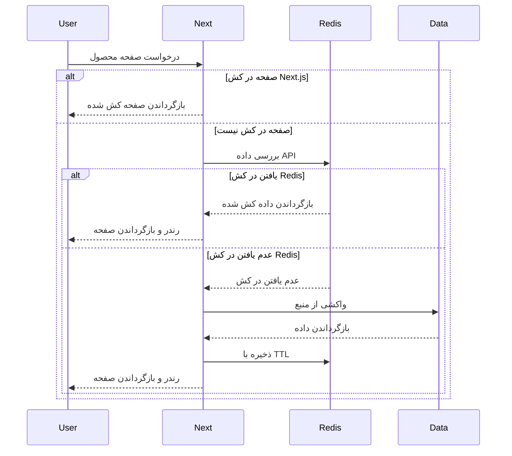
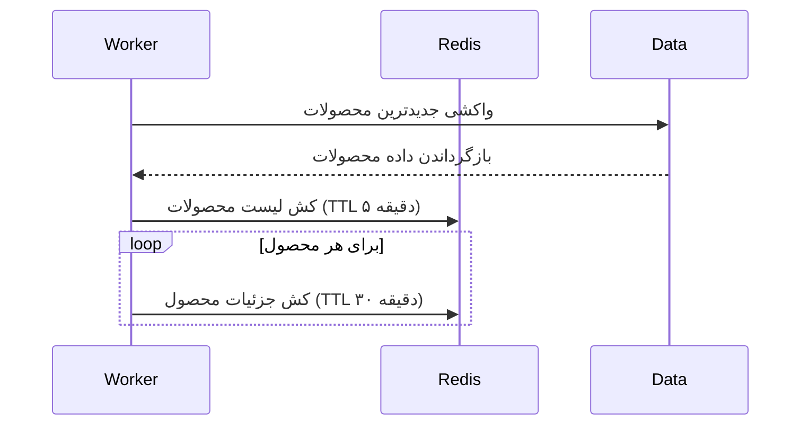
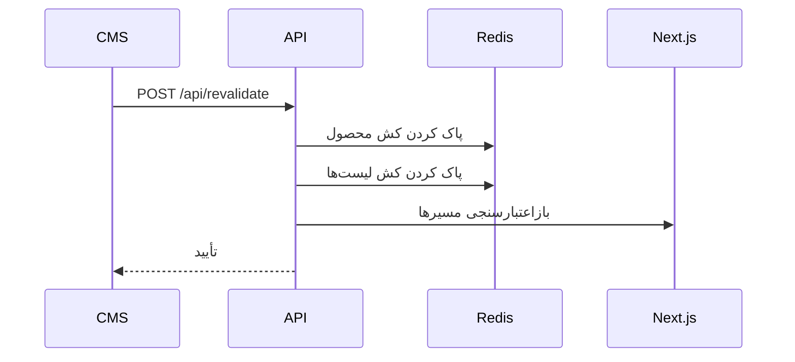

# اسنک‌شاپ - دموی فروشگاه اینترنتی

این پروژه یک نمونه اپلیکیشن فروشگاه اینترنتی با استفاده از Next.js و کشینگ Redis را به نمایش می‌گذارد. هدف آن شبیه‌سازی یک بازار آنلاین بزرگ (بیش از ۲۰ هزار محصول، بیش از ۵ میلیون کاربر) است که در آن سرعت بارگذاری صفحات و عملکرد سرور اهمیت حیاتی دارد.

<div style="display: flex; justify-content: center;">
  
</div>

## معماری اصلی

- **فریم‌ورک**: Next.js 15 (App Router)
- **کشینگ**: استراتژی کشینگ مبتنی بر Redis برای داده‌های محصولات و پاسخ‌های API
- **رندرینگ**: رویکرد رندرینگ ترکیبی بهینه‌سازی شده برای هر نوع صفحه
- **چندزبانه (i18n)**: پشتیبانی از انگلیسی و فارسی با استفاده از `next-intl`
- **مدیریت وضعیت**: داده‌های سبد خرید در Redis ذخیره شده و در سمت کلاینت با Zustand مدیریت می‌شود
- **تست**: تست‌های واحد و End-to-End با Jest و Cypress

## محدودیت‌های عمدی

این پروژه به‌عمد محدودیت‌هایی را برای تمرکز بر قابلیت‌های اصلی اعمال می‌کند:

- **کتابخانه‌های حداقلی**: کاهش پیچیدگی و حجم باندل با استفاده از بسته‌های ضروری
- **بدون کتابخانه‌های UI**: فقط از CSS Modules برای استایل‌دهی استفاده می‌شود
- **بدون احراز هویت**: استفاده از کوکی‌های شناسه نشست برای ردیابی سبد خرید
- **بدون آنالیتیکس**: شبیه‌سازی محصولات پربازدید با کش کردن ۸ محصول جدیدتر
- **بدون دیتابیس**: استفاده از فایل JSON برای ذخیره داده‌های محصولات

## الگوهای رندرینگ

هر نوع صفحه از استراتژی رندرینگ خاصی در Next.js با کشینگ Redis برای بهینه‌سازی عملکرد استفاده می‌کند.

### صفحات لیست محصولات (PLP - `/`)

- **استراتژی Next.js**: رندرینگ داینامیک با Incremental Static Regeneration (ISR)
  - از React Server Components برای واکشی داده در سمت سرور استفاده می‌کند
  - با `revalidate = 60` بازسازی صفحه هر ۶۰ ثانیه پیکربندی می‌شود
- **دلیل**: ایجاد تعادل بین تازگی داده‌ها و عملکرد. نمایش لیست محصولات به‌روز و کاهش فراخوانی‌های API
- **استراتژی کش Redis**:
  - پاسخ‌های API لیست محصولات با TTL ۵ دقیقه‌ای کش می‌شوند
  - دسترسی سریع‌تر به داده‌ها قبل از فعال شدن بازسازی ISR در Next.js

```tsx
// src/app/[locale]/page.tsx - پیکربندی ISR در Next.js
export const revalidate = 60; // بازسازی صفحه حداکثر یک بار در هر ۶۰ ثانیه

// src/constants/index.ts - تعریف TTL برای داده‌های API لیست محصولات در Redis
export const PRODUCT_LIST_CACHE_TTL = 5 * 60; // ۵ دقیقه
```

### صفحات جزئیات محصول (PDP - `/products/[productId]`)

- **استراتژی Next.js**: تولید استاتیک (SSG) در زمان ساخت برای ۸ محصول جدیدتر، با ISR برای همه صفحات محصول
  - پیش‌رندر ۸ محصول جدیدتر از طریق `generateStaticParams`
  - تنظیم بازسازی ساعتی با `revalidate = 3600`
  - فعال‌سازی تولید صفحه در زمان درخواست با `dynamicParams = true`
- **دلیل**: بهینه‌سازی محصولات پربازدید با سرو از edge/CDN. ISR صفحات کم‌بازدیدتر را بدون نیاز به بازسازی کامل به‌روز نگه می‌دارد
- **استراتژی کش Redis**:
  - پاسخ‌های API جزئیات محصول با TTL ۳۰ دقیقه‌ای کش می‌شوند
  - دسترسی سریع‌تر از انتظار برای فاصله ISR یک‌ساعته

```tsx
// src/app/[locale]/products/[productId]/page.tsx
export const revalidate = 3600; // بازسازی صفحه حداکثر یک بار در هر ساعت (ISR)
export const dynamicParams = true; // اجازه تولید صفحات ساخته نشده در زمان بیلد

// src/constants/index.ts - تعریف TTL برای داده‌های API جزئیات محصول در Redis
export const PRODUCT_DETAIL_CACHE_TTL = 30 * 60; // ۳۰ دقیقه
```

### سبد خرید و تسویه حساب

- **پیاده‌سازی**: سمت کلاینت با Zustand برای مدیریت وضعیت
- **دلیل**: ارائه بازخورد فوری به کاربر و کاهش بار سرور
- **ماندگاری**: همگام‌سازی داده‌های سبد خرید با Redis برای سازگاری

```tsx
// src/store/store.ts
import { create } from "zustand";
export const useCartStore = create<CartState>()((set, get) => ({
  // عملیات سبد خرید که با سرور همگام می‌شوند
  fetchCart: async () => {
    // دریافت از /api/cart
  },
  addToCart: async (product, quantity = 1) => {
    // به‌روزرسانی خوش‌بینانه و همگام‌سازی با سرور
  },
  // ...
}));
```

## بهینه‌سازی‌های عملکرد

### معماری کشینگ چندلایه

این پروژه یک استراتژی کشینگ چندلایه پیاده‌سازی می‌کند:

1. **لایه ISR در Next.js**: کش صفحات رندر شده با ابطال زمان‌بندی شده
2. **لایه کش Redis**: کش پاسخ‌های API قبل از رسیدن به Next.js
3. **لایه CDN/Edge**: کش صفحات ISR در لبه شبکه هنگام دیپلوی در پلتفرم‌هایی مانند Vercel



### استراتژی کشینگ Redis

برنامه از Redis برای کشینگ با کارایی بالا با TTLهای مناسب استفاده می‌کند:

- **لیست محصولات**: ۵ دقیقه (`PRODUCT_LIST_CACHE_TTL`)
- **جزئیات محصول**: ۳۰ دقیقه (`PRODUCT_DETAIL_CACHE_TTL`)
- **محصولات مرتبط**: ۱۵ دقیقه (`RELATED_PRODUCTS_CACHE_TTL`)

هر ورودی کش از یک الگوی کلید ساختارمند استفاده می‌کند:

```
products:{page}:{pageSize}:{sort}    // برای لیست‌های محصول
product:{productId}                  // برای جزئیات محصول
related:{productId}:{locale}:{limit} // برای محصولات مرتبط
```

```typescript
// src/services/productService.ts
export async function fetchProducts({
  page = 1,
  limit,
  pageSize,
  sort = DEFAULT_SORT_ORDER,
}: FetchProductsParams = {}): Promise<ProductsResponse> {
  const cacheKey = `${CACHE_KEY_PRODUCT_LIST_PREFIX}${page}:${effectivePageSize}:${sort}`;
  const cachedData = await checkCache<ProductsResponse>(cacheKey);
  if (cachedData) {
    return cachedData;
  }
  // واکشی و کش در صورت عدم یافتن...
}
```

### فرآیند گرم کردن کش

یک worker مستقل (`src/workers/cacheWarmer.ts`) هر ۱۰ دقیقه داده‌های کلیدی را در Redis پیش‌بارگذاری می‌کند:



این worker به صورت فعال این موارد را کش می‌کند:

1. صفحه اول پیش‌فرض محصولات (رایج‌ترین نقطه ورود)
2. جزئیات هر محصول در آن صفحه اول

```typescript
// src/utils/cache/cacheWarming.ts
export async function warmCache(): Promise<void> {
  // واکشی لیست محصول پیش‌فرض
  const productListData = await fetchProducts({
    page: 1,
    pageSize: DEFAULT_PAGE_SIZE,
    sort: DEFAULT_SORT_ORDER,
  });

  // کش کردن لیست
  const listCacheKey = `${CACHE_KEY_PRODUCT_LIST_PREFIX}1:${DEFAULT_PAGE_SIZE}:${DEFAULT_SORT_ORDER}`;
  await setCache(listCacheKey, productListData, PRODUCT_LIST_CACHE_TTL);

  // کش کردن جزئیات برای هر محصول
  const productsToWarm = productListData.products;
  for (const product of productsToWarm) {
    const detailCacheKey = `${CACHE_KEY_PRODUCT_DETAIL_PREFIX}${product.id}`;
    await setCache(detailCacheKey, { product }, PRODUCT_DETAIL_CACHE_TTL);
  }
}
```

### ابطال کش

برنامه یک نقطه پایانی امن `/api/revalidate` ارائه می‌دهد که ابطال دوگانه انجام می‌دهد:



این فرآیند ابطال:

1. کش Redis را برای محصول خاص و لیست‌ها باطل می‌کند
2. بازاعتبارسنجی مسیر Next.js را فعال می‌کند تا صفحات تحت تأثیر را بازسازی کند
3. فرآیند را با احراز هویت مبتنی بر توکن ایمن می‌کند

```typescript
// src/app/api/revalidate/route.ts
export async function POST(request: NextRequest) {
  // اعتبارسنجی درخواست و دریافت داده
  const { productId, localesToRevalidate } = validationResult;

  // انجام ابطال دوگانه
  await invalidateProductCache(productId);
  await invalidateProductListingCache();
  revalidateNextPaths(productId, localesToRevalidate);

  // بازگرداندن تأیید
  return NextResponse.json({ revalidated: true /* ... */ });
}
```

### مکانیزم پشتیبان

سیستم شامل یک کش درون‌حافظه پشتیبان است که در صورت عدم دسترسی به Redis فعال می‌شود:

```typescript
// src/utils/cache/client/redis.ts
async function getClient(): Promise<CacheClient | null> {
  const { client, error } = await clientState;
  if (error && !client.isFallback) {
    console.error(`[Cache] Using fallback due to Redis initialization error`);
  }
  return client;
}
```

### بهینه‌سازی تصاویر

- استفاده از کامپوننت Image نکست برای انتخاب فرمت و سایزبندی پاسخگو
- پیاده‌سازی بارگذاری تنبل برای تصاویر زیر صفحه
- ارائه یکپارچه‌سازی اختیاری با Cloudinary CDN از طریق متغیر محیطی

### تمرکز بر Core Web Vitals

- بهینه‌سازی LCP با اولویت‌بندی بارگذاری محتوای حیاتی
- کاهش CLS با حفظ نسبت‌های ابعاد صحیح تصاویر
- بهبود FID با کاهش کار رشته اصلی با کامپوننت‌های سرور React

### بهینه‌سازی‌های کد

- استفاده از کامپوننت‌های مشترک برای رابط کاربری یکنواخت و کاهش حجم باندل

## اجرای پروژه

**۱. اپلیکیشن اصلی:**

```bash
# نصب وابستگی‌ها
npm install

# اجرای سرور توسعه
npm run dev

# --- یا ---

# بیلد برای پروداکشن
npm run build

# اجرای سرور پروداکشن
npm start
```

**۲. Worker گرم کردن کش (اختیاری):**

```bash
# اجرای worker در حالت توسعه
npm run cache:warm:dev

# --- یا ---

# اجرای worker در حالت پروداکشن
npm run cache:warm:prod
```

## تست

- **تست‌های واحد**: Jest برای تست توابع و کامپوننت‌ها
- **تست‌های E2E**: Cypress برای جریان‌های کاربری مهم (مرور محصولات، مدیریت سبد خرید)
- **تست دستی**: طراحی واکنش‌گرا در دستگاه‌های مختلف بررسی شده

```bash
# اجرای تست‌های واحد
npm run test:unit

# اجرای تست‌های E2E
npm run test:e2e
```

## پیکربندی

فایل `.env.example` را به `.env.local` در ریشه پروژه کپی کرده و متغیرهای لازم را تنظیم کنید:

```env
# لازم برای اتصال به Redis
REDIS_URL=...

# اختیاری: استفاده از Cloudinary CDN برای تصاویر
# اگر false باشد، از بهینه‌سازی next/image استفاده می‌شود
NEXT_PUBLIC_USE_CLOUDINARY_CDN=true

...

```

## ساختار پروژه

```
├── src/
│   ├── app/            # صفحات App Router نکست، layoutها و روت‌های API
│   ├── components/     # کامپوننت‌های UI قابل استفاده مجدد
│   ├── data/           # فایل داده products.json
│   ├── features/       # ساختار پوشه مبتنی بر فیچر
│   ├── i18n/           # تنظیمات و دیکشنری‌های محلی‌سازی
│   ├── services/       # سرویس‌های API و داده
│   ├── store/          # استور Zustand برای مدیریت سبد خرید
│   ├── types/          # تعریف تایپ‌های TypeScript
│   ├── utils/          # توابع کمکی
│   └── workers/        # Workerهای پس‌زمینه برای گرم کردن کش
├── public/             # فایل‌های استاتیک
├── cypress/            # تست‌های E2E
```

## اسکرین‌شات‌ها

| صفحه اصلی (انگلیسی)                                                                                               | صفحه اصلی (فارسی)                                                                                               | صفحه جزئیات محصول (PDP)                                                                                     | لاگ‌های Redis                                                                                                  |
| ----------------------------------------------------------------------------------------------------------------- | --------------------------------------------------------------------------------------------------------------- | ----------------------------------------------------------------------------------------------------------- | -------------------------------------------------------------------------------------------------------------- |
|  |  |  |  |
